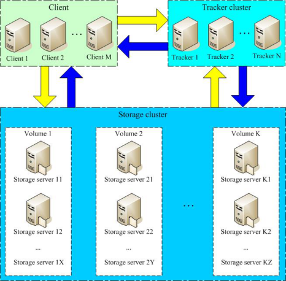
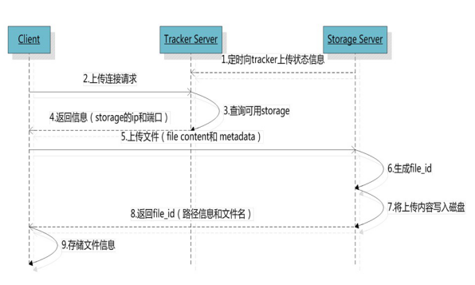
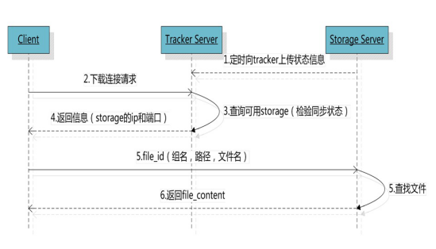
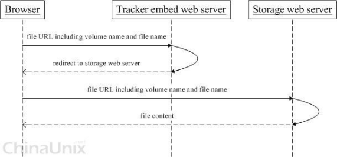
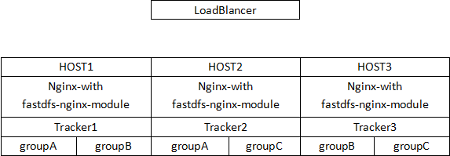

**Note**: `FastDFS`是一个开源的轻量级分布式文件系统，由跟踪服务器（`tracker server`）、存储服务器（`storage server`）和客户端（`client`）三个部分组成，主要解决了海量数据存储问题，特别适合以中小文件（建议范围：`4KB < file_size <500MB`）为载体的在线服务。

  
## Storage server
* Storage server（后简称storage）以组（卷，group或volume）为单位组织，一个group内包含多台storage机器，数据互为备份，存储空间以group内容量最小的storage为准，所以建议group内的多个storage尽量配置相同，以免造成存储空间的浪费。

* 以group为单位组织存储能方便的进行应用隔离、负载均衡、副本数定制（group内storage server数量即为该group的副本数），比如将不同应用数据存到不同的group就能隔离应用数据，同时还可根据应用的访问特性来将应用分配到不同的group来做负载均衡；缺点是group的容量受单机存储容量的限制，同时当group内有机器坏掉时，数据恢复只能依赖group内地其他机器，使得恢复时间会很长。

* group内每个storage的存储依赖于本地文件系统，storage可配置多个数据存储目录，比如有10块磁盘，分别挂载在/data/disk1-/data/disk10，则可将这10个目录都配置为storage的数据存储目录。

* storage接受到写文件请求时，会根据配置好的规则（后面会介绍），选择其中一个存储目录来存储文件。为了避免单个目录下的文件数太多，在storage第一次启动时，会在每个数据存储目录里创建2级子目录，每级256个，总共65536个文件，新写的文件会以hash的方式被路由到其中某个子目录下，然后将文件数据直接作为一个本地文件存储到该目录中。

## Tracker server

* Tracker是FastDFS的协调者，负责管理所有的storage server和group，每个storage在启动后会连接Tracker，告知自己所属的group等信息，并保持周期性的心跳，tracker根据storage的心跳信息，建立group==>[storage server list]的映射表。
* Tracker需要管理的元信息很少，会全部存储在内存中；另外tracker上的元信息都是由storage汇报的信息生成的，本身不需要持久化任何数据，这样使得tracker非常容易扩展，直接增加tracker机器即可扩展为tracker cluster来服务，cluster里每个tracker之间是完全对等的，所有的tracker都接受stroage的心跳信息，生成元数据信息来提供读写服务。

## Upload file

* FastDFS向使用者提供基本文件访问接口，比如upload、download、append、delete等，以客户端库的方式提供给用户使用。

  

##### 1. 选择tracker server
当集群中不止一个tracker server时，由于tracker之间是完全对等的关系，客户端在upload文件时可以任意选择一个trakcer。
##### 2. 选择存储的group
当tracker接收到upload file的请求时，会为该文件分配一个可以存储该文件的group，支持如下选择group的规则：
1. Round robin，所有的group间轮询
2. Specified group，指定某一个确定的group
3. Load balance，剩余存储空间多多group优先

##### 3. 选择storage server
当选定group后，tracker会在group内选择一个storage server给客户端，支持如下选择storage的规则：
1. Round robin，在group内的所有storage间轮询
2. First server ordered by ip，按ip排序
3. First server ordered by priority，按优先级排序（优先级在storage上配置）

#####  4. 选择storage path

  当分配好storage server后，客户端将向storage发送写文件请求，storage将会为文件分配一个数据存储目录，支持如下规则：
  1. Round robin，多个存储目录间轮询
  2. 剩余存储空间最多的优先

##### 5. 生成Fileid
选定存储目录之后，storage会为文件生一个Fileid，由storage server ip、文件创建时间、文件大小、文件crc32和一个随机数拼接而成，然后将这个二进制串进行base64编码，转换为可打印的字符串。
##### 6. 选择两级目录
当选定存储目录之后，storage会为文件分配一个fileid，每个存储目录下有两级256*256的子目录，storage会按文件fileid进行两次hash（猜测），路由到其中一个子目录，然后将文件以fileid为文件名存储到该子目录下。
##### 7. 生成文件名
  当文件存储到某个子目录后，即认为该文件存储成功，接下来会为该文件生成一个文件名，文件名由group、存储目录、两级子目录、fileid、文件后缀名（由客户端指定，主要用于区分文件类型）拼接而成。

##### 8. 文件同步

* 写文件时，客户端将文件写至group内一个storage server即认为写文件成功，storage server写完文件后，会由后台线程将文件同步至同group内其他的storage server。
* 每个storage写文件后，同时会写一份binlog，binlog里不包含文件数据，只包含文件名等元信息，这份binlog用于后台同步，storage会记录向group内其他storage同步的进度，以便重启后能接上次的进度继续同步；进度以时间戳的方式进行记录，所以最好能保证集群内所有server的时钟保持同步。
* storage的同步进度会作为元数据的一部分汇报到tracker上，tracke在选择读storage的时候会以同步进度作为参考。

**打个比方**:  比如一个group内有A、B、C三个storage server，A向C同步到进度为T1 (T1以前写的文件都已经同步到B上了），B向C同步到时间戳为T2（T2 > T1)，tracker接收到这些同步进度信息时，就会进行整理，将最小的那个做为C的同步时间戳，本例中T1即为C的同步时间戳为T1（即所有T1以前写的数据都已经同步到C上了）；同理，根据上述规则，tracker会为A、B生成一个同步时间戳。
##### Download file
* 客户端upload file成功后，会拿到一个storage生成的文件名，接下来客户端根据这个文件名即可访问到该文件。

跟upload file一样，在download file时客户端可以选择任意tracker server。tracker发送download请求给某个tracker，必须带上文件名信息，tracke从文件名中解析出文件的group、大小、创建时间等信息，然后为该请求选择一个storage用来服务读请求。由于group内的文件同步时在后台异步进行的，所以有可能出现在读到时候，文件还没有同步到某些storage server上，为了尽量避免访问到这样的storage，tracker按照如下规则选择group内可读的storage。

1. 该文件上传到的源头storage - 源头storage只要存活着，肯定包含这个文件，源头的地址被编码在文件名中。
2. 文件创建时间戳==storage被同步到的时间戳 且(当前时间-文件创建时间戳) > 文件同步最大时间（如5分钟) - 文件创建后，认为经过最大同步时间后，肯定已经同步到其他storage了。
3. 文件创建时间戳 < storage被同步到的时间戳。 - 同步时间戳之前的文件确定已经同步了 4. (当前时间-文件创建时间戳) > 同步延迟阀值（如一天）。 - 经过同步延迟阈值时间，认为文件肯定已经同步了。

##### 小文件合并存储
将小文件合并存储主要解决如下几个问题：
1. 本地文件系统inode数量有限，从而存储的小文件数量也就受到限制。
2. 多级目录+目录里很多文件，导致访问文件的开销很大（可能导致很多次IO）
3. 按小文件存储，备份与恢复的效率低

FastDFS在V3.0版本里引入小文件合并存储的机制，可将多个小文件存储到一个大的文件（trunk file），为了支持这个机制，FastDFS生成的文件fileid需要额外增加16个字节

1. trunk file id
2. 文件在trunk file内部的offset
3. 文件占用的存储空间大小 （字节对齐及删除空间复用，文件占用存储空间>=文件大小）

每个trunk file由一个id唯一标识，trunk file由group内的trunk server负责创建（trunk server是tracker选出来的），并同步到group内其他的storage，文件存储合并存储到trunk file后，根据其offset就能从trunk file读取到文件。文件在trunk file内的offset编码到文件名，决定了其在trunk file内的位置是不能更改的，也就不能通过compact的方式回收trunk file内删除文件的空间。但当trunk file内有文件删除时，其删除的空间是可以被复用的，比如一个100KB的文件被删除，接下来存储一个99KB的文件就可以直接复用这片删除的存储空间。
##### HTTP访问支持
* FastDFS的tracker和storage都内置了http协议的支持，客户端可以通过http协议来下载文件，tracker在接收到请求时，通过http的redirect机制将请求重定向至文件所在的storage上；除了内置的http协议外，FastDFS还提供了通过apache或nginx扩展模块下载文件的支持。

*以上部分摘自网友文章:
http://blog.chinaunix.net/uid-20196318-id-4058561.html*

#### FastDFS之Tracker-Leader选择
###### 一、Tracker-Leader概述
在FastDFS之中，可以任意配置多个Tracker，在运行过程中会选择其中一个作为Leader，由该Leader执行一些唯一性的操作。在早期版本中Tracker-Leader有两个作用，分别是：为新加入的Storage分配一个源Storage；为开启合并存储的Group选择Trunk-Server。但是在最新的版本中实际上只有第二个作用，也就是选择Trunk-Server。对于新加入Storage分配源其实是任何一个Tracker都可以进行的，为了避免多次分配，在Storage请求Tracker分配源时进行了互斥量同步。
###### 二、Tracker-Relationship线程
在Tracker程序启动后，会启动一个Relationship线程，专门负责Leader的选择，与同Leader的通讯（若自己不是Leader）。该线程的逻辑很简单，检查内存结构是否设置了Leader，若没有设置Leader，则选择一个Leader，否则向该Leader执行一个Ping操作。
###### 1)、选择(查询)Leader(relationship_select_leader函数)
1. 向所有的Tracker（包括自己）发送一个TRACKER_GET_STATUS命令，来获取对方的状态信息，该信息包括：是否为Leader；到目前的运行时间；上次停止时间间隔（也就是最后一次停止到启动的时间间隔）；只要获取到至少一个该状态成功，则继续下一步：
2. 对所有返回成功的Tracker-Status进行排序（根据上一步的信息顺序比较），获得状态值最高的Tracker
3. 若状态最高的Tracker就是自己，那么进入一个两阶段提交协议：
通知除自己之外的所有Tracker，将要变更Tracker-Leader，只要有一个Tracker通知成功，则进入下一步；
通知所有的Tracker（包括自己），将Leader变更成自己，只要有一个Tracker返回成功，则表示整个变更成功；（此处通知了自己，那么这个步骤肯定会成功）。
4. 若最高状态的Tracker当前就是Leader，那么就设置本地标志为g_tracker_servers.leader_index，表示Leader已经确定。
5. 否则，等待真正的Leader发起Leader变更消息

**Note:** 这里的逻辑，多少让人不放心，若有三个或以上的Tracker并且中间出现网络不通的情况，很有可能会产生两个Leader。不过要记住，Leader只有在开启了合并存储时，才使用来选择Trunk-Server。其他时候是没用的。
###### 2)、与Leader心跳(Ping#relationship_ping_leader函数)
向Tracker-Leader发送一个TRACKER_PING_LEADER消息，该Tracker将响应一个数组，该数组每个成员为一个结构体如下：
* {group_name，trunk-server-id}
* 通知这个消息可以从Leader中获取每个Group当前的Trunk-Server是哪个。

*以上部分摘自网友文章:
http://blog.csdn.net/hfty290/article/details/42030339*

安装包

[FastDFS-v4.06下载](https://goreportcard.com/report/github.com/coreos/etcd)

[fastdfs-nginx-module_v1.15下载](https://storage.googleapis.com/google-code-archive-downloads/v2/code.google.com/fastdfs/fastdfs-nginx-module_v1.15.tar.gz)

[Nginx-1.11.10](http://nginx.org/download/nginx-1.11.10.tar.gz)

#### 本次部署结构

* 系统环境:centos7最小安装,安装编译环境及pcre(yum)
* 在每台机器上创建目录

  #mkdir -p /data/dfs/{group1,group2,grou3,group4,tracker}

##### 默认client配置:(
PS:所有默认配置在fastDFS源码包里都有)

[client_default](default-conf/client.conf)

##### 本例配置:
    [root@localhost fdfs]# cat /etc/fdfs/client.conf
    connect_timeout=30
    network_timeout=60
    base_path=/data/dfs/tracker
    tracker_server=192.168.88.149:22122
    tracker_server=192.168.88.150:22122
    tracker_server=192.168.88.134:22122
    log_level=info
    use_connection_pool = false
    connection_pool_max_idle_time = 3600
    load_fdfs_parameters_from_tracker=false
    use_storage_id = false
    storage_ids_filename = storage_ids.conf
    http.tracker_server_port=8080

##### 默认tracker server配置
[tracker_default](default-conf/tracker.conf)

##### 本例配置
    [root@localhost fdfs]# cat /etc/fdfs/tracker.conf
    disabled=false
    bind_addr=
    port=22122
    connect_timeout=30
    network_timeout=60
    base_path=/data/dfs/tracker
    max_connections=256
    work_threads=4
    store_lookup=0
    store_group=group1
    store_server=0
    store_path=0
    download_server=0
    reserved_storage_space = 10%
    log_level=info
    run_by_group=
    run_by_user=
    allow_hosts=*
    sync_log_buff_interval = 10
    check_active_interval = 120
    thread_stack_size = 64KB
    storage_ip_changed_auto_adjust = true
    storage_sync_file_max_delay = 86400
    storage_sync_file_max_time = 300
    use_trunk_file = true
    slot_min_size = 256
    slot_max_size = 16MB
    trunk_file_size = 64MB
    trunk_create_file_advance = false
    trunk_create_file_time_base = 02:00
    trunk_create_file_interval = 86400
    trunk_create_file_space_threshold = 20G
    trunk_init_check_occupying = false
    trunk_init_reload_from_binlog = false
    use_storage_id = false
    storage_ids_filename = storage_ids.conf
    id_type_in_filename = ip
    store_slave_file_use_link = false
    rotate_error_log = false
    error_log_rotate_time=00:00
    rotate_error_log_size = 0
    use_connection_pool = false
    connection_pool_max_idle_time = 3600
    http.server_port=8080
    http.check_alive_interval=30
    http.check_alive_type=tcp
    http.check_alive_uri=/status.html

##### Storage配置
##### 默认storage配置
[storage_default](default-conf/storage.conf)
##### 本例配置:
PS:同一台机器上A,B,C三组配置除了端口和路径不一致,其他相同

    [root@localhost fdfs]# cat /etc/fdfs/storage_A.conf
    disabled=false
    group_name=groupA
    bind_addr=
    client_bind=true
    port=23000[本处在groupB,C处分别为23001,23002]
    connect_timeout=30
    network_timeout=60
    heart_beat_interval=30
    stat_report_interval=60
    base_path=/data/dfs/group1[本处在groupB,C处分别为group2,group3]
    max_connections=256
    buff_size = 256KB
    work_threads=4
    disk_rw_separated = true
    disk_reader_threads = 1
    disk_writer_threads = 1
    sync_wait_msec=50
    sync_interval=0
    sync_start_time=00:00
    sync_end_time=23:59
    write_mark_file_freq=500
    store_path_count=1[存储路径数量]
    store_path0=/data/dfs/group1[存储路径启动的一个从0开始到9?]
    subdir_count_per_path=256
    tracker_server=192.168.88.150:22122
    tracker_server=192.168.88.149:22122
    tracker_server=192.168.88.134:22122
    log_level=info
    run_by_group=
    run_by_user=
    allow_hosts=*
    file_distribute_path_mode=0
    file_distribute_rotate_count=100
    fsync_after_written_bytes=0
    sync_log_buff_interval=10
    sync_binlog_buff_interval=10
    sync_stat_file_interval=300
    thread_stack_size=512KB
    upload_priority=10
    if_alias_prefix=
    check_file_duplicate=0
    file_signature_method=hash
    key_namespace=FastDFS
    keep_alive=0
    use_access_log = false
    rotate_access_log = false
    access_log_rotate_time=00:00
    rotate_error_log = false
    error_log_rotate_time=00:00
    rotate_access_log_size = 0
    rotate_error_log_size = 0
    file_sync_skip_invalid_record=false
    use_connection_pool = false
    connection_pool_max_idle_time = 3600
    http.domain_name=
    http.server_port=8888

##### mod_fastdfs默认配置:
PS:mod_fastdfs.conf是nginx或httpd使用的一些数据?默认位置/etc/fdfs/mod_fastdfs.conf 似乎无法修改位置
[mod_fastdfs_default](default-conf/mod_fastdfs.conf)
##### 本例配置
    [root@localhost fdfs]# cat /etc/fdfs/mod_fastdfs.conf
    connect_timeout=2
    network_timeout=30
    base_path=/data/dfs/tracker
    load_fdfs_parameters_from_tracker=true
    storage_sync_file_max_delay = 86400
    use_storage_id = false
    storage_ids_filename = storage_ids.conf
    tracker_server=192.168.88.149:22122
    tracker_server=192.168.88.150:22122
    tracker_server=192.168.88.134:22122
    #storage_server_port=23000
    #group_name=groupC
    url_have_group_name = true
    #store_path_count=3
    #store_path0=/data/dfs/group1
    #store_path1=/data/dfs/group2
    #store_path2=/data/dfs/group3
    log_level=info
    log_filename=
    response_mode=proxy
    if_alias_prefix=
    http.need_find_content_type=false
    flv_support = true
    flv_extension = flv
    group_count = 2

    [group1]
    group_name=groupA
    storage_server_port=23000
    store_path_count=1
    store_path0=/data/dfs/group1

    [group2]
    group_name=groupB
    storage_server_port=23001
    store_path_count=1
    store_path0=/data/dfs/group2

    #[group3]
    #group_name=groupC
    #storage_server_port=23002
    #store_path_count=1
    #store_path0=/data/dfs/group3
**PS**,此处的group组配置为本地组配置,必须从group1开始,例如本地有groupB,groupC,那么组配置为,否则nginx模块在启动时会报错:

    ERROR - file: /usr/local/src/fastdfs-nginx-module/src//common.c, line: 103, section: group1, you must set parameter: group_name!
如下所示:

    [group1]
    group_name=groupA
    storage_server_port=23000
    store_path_count=1
    store_path0=/data/dfs/groupB

    [group2]
    group_name=groupC
    storage_server_port=23001
    store_path_count=1
    store_path0=/data/dfs/groupC

##### Nginx编译:
    [root@localhost fdfs]# /usr/local/nginx/sbin/nginx -V
    nginx version: nginx/1.11.10
    built by gcc 4.8.5 20150623 (Red Hat 4.8.5-11) (GCC)
    configure arguments: --add-module=/usr/local/src/fastdfs-nginx-module/src/ --prefix=/usr/local/nginx

##### Nginx配置:
    [root@localhost fdfs]# grep -Ev "#|^$" /usr/local/nginx/conf/nginx.conf
    worker_processes  1;
    events {
        worker_connections  1024;
    }
    http {
        include       mime.types;
        default_type  application/octet-stream;
        sendfile        on;
        keepalive_timeout  65;
        server {
            listen       8080;
            server_name  localhost;
            location   /group {
                ngx_fastdfs_module;
    	root /data/dfs/;
            }
            error_page   500 502 503 504  /50x.html;
            location = /50x.html {
                root   html;
            }
        }
    }
环境变量设置:略
启动环境:

##### HOST1:

    [root@localhost fdfs]# pwd
    /etc/fdfs
    
    [root@localhost fdfs]# fdfs_trackerd  tracker.conf
    [root@localhost fdfs]# fdfs_storaged torage_A.conf
    [root@localhost fdfs]# fdfs_storaged torage_B.conf    
    [root@localhost fdfs]# /usr/local/nginx/sbin/nginx
    
##### HOST2:
    [root@localhost fdfs]# pwd
    /etc/fdfs
    
    [root@localhost fdfs]# fdfs_trackerd  tracker.conf
    [root@localhost fdfs]# fdfs_storaged torage_A.conf
    [root@localhost fdfs]# fdfs_storaged torage_C.conf
    [root@localhost fdfs]# /usr/local/nginx/sbin/nginx
##### HOST3:
    [root@localhost fdfs]# pwd
    /etc/fdfs
    
    [root@localhost fdfs]# fdfs_trackerd  tracker.conf
    [root@localhost fdfs]# fdfs_storaged torage_C.conf
    [root@localhost fdfs]# fdfs_storaged torage_B.conf
    [root@localhost fdfs]# /usr/local/nginx/sbin/nginx
##### 测试:
为方便测试,本例子存储时使用轮训方法,实际使用建议按照空间剩余方法来存储

    [root@localhost fdfs]# fdfs_test /etc/fdfs/client.conf upload ~/anaconda-ks.cfg
    This is FastDFS client test program v4.06

    Copyright (C) 2008, Happy Fish / YuQing

    FastDFS may be copied only under the terms of the GNU General
    Public License V3, which may be found in the FastDFS source kit.
    Please visit the FastDFS Home Page http://www.csource.org/
    for more detail.

    [2017-03-22 02:31:37] DEBUG - base_path=/data/dfs/tracker, connect_timeout=30, network_timeout=60, tracker_server_count=3, anti_steal_token=0, anti_steal_secret_key length=0, use_connection_pool=0, g_connection_pool_max_idle_time=3600s, use_storage_id=0, storage server id count: 0

    tracker_query_storage_store_list_without_group:
    	server 1. group_name=, ip_addr=192.168.88.149, port=23000
    	server 2. group_name=, ip_addr=192.168.88.150, port=23000

    group_name=groupB, ip_addr=192.168.88.149, port=23001
    storage_upload_by_filename
    group_name=groupB, remote_filename=M00/00/00/wKhYlVjSGkmAKSsbAAAFX016BtA960.cfg
    source ip address: 192.168.88.149
    file timestamp=2017-03-22 02:31:37
    file size=1375
    file crc32=1299842768
    file url: http://192.168.88.134:8080/groupB/M00/00/00/wKhYlVjSGkmAKSsbAAAFX016BtA960.cfg
    storage_upload_slave_by_filename
    group_name=groupB, remote_filename=M00/00/00/wKhYlVjSGkmAKSsbAAAFX016BtA960_big.cfg
    source ip address: 192.168.88.149
    file timestamp=2017-03-22 02:31:37
    file size=1375
    file crc32=1299842768
    file url: http://192.168.88.134:8080/groupB/M00/00/00/wKhYlVjSGkmAKSsbAAAFX016BtA960_big.cfg

##### http下载测试

    [root@localhost fdfs]# wget http://192.168.88.134:8080/groupB/M00/00/00/wKhYlVjSGkmAKSsbAAAFX016BtA960.cfg
    --2017-03-22 02:33:17--  http://192.168.88.134:8080/groupB/M00/00/00/wKhYlVjSGkmAKSsbAAAFX016BtA960.cfg
    Connecting to 192.168.88.134:8080... connected.
    HTTP request sent, awaiting response... 200 OK
    Length: 1375 (1.3K)
    Saving to: ‘wKhYlVjSGkmAKSsbAAAFX016BtA960.cfg’

    100%[===================================================================================================================>] 1,375       --.-K/s   in 0s      

    2017-03-22 02:33:17 (95.7 MB/s) - ‘wKhYlVjSGkmAKSsbAAAFX016BtA960.cfg’ saved [1375/1375]
    [root@localhost fdfs]# wget http://192.168.88.149:8080/groupB/M00/00/00/wKhYlVjSGkmAKSsbAAAFX016BtA960.cfg
    --2017-03-22 02:33:23--  http://192.168.88.149:8080/groupB/M00/00/00/wKhYlVjSGkmAKSsbAAAFX016BtA960.cfg
    Connecting to 192.168.88.149:8080... connected.
    HTTP request sent, awaiting response... 200 OK
    Length: 1375 (1.3K)
    Saving to: ‘wKhYlVjSGkmAKSsbAAAFX016BtA960.cfg.1’

    100%[===================================================================================================================>] 1,375       --.-K/s   in 0s      

    2017-03-22 02:33:23 (115 MB/s) - ‘wKhYlVjSGkmAKSsbAAAFX016BtA960.cfg.1’ saved [1375/1375]

    [root@localhost fdfs]# wget http://192.168.88.150:8080/groupB/M00/00/00/wKhYlVjSGkmAKSsbAAAFX016BtA960.cfg
    --2017-03-22 02:33:28--  http://192.168.88.150:8080/groupB/M00/00/00/wKhYlVjSGkmAKSsbAAAFX016BtA960.cfg
    Connecting to 192.168.88.150:8080... connected.
    HTTP request sent, awaiting response... 200 OK
    Length: 1375 (1.3K)
    Saving to: ‘wKhYlVjSGkmAKSsbAAAFX016BtA960.cfg.2’

    100%[===================================================================================================================>] 1,375       --.-K/s   in 0s      

    2017-03-22 02:33:28 (110 MB/s) - ‘wKhYlVjSGkmAKSsbAAAFX016BtA960.cfg.2’ saved [1375/1375]

#### Leader切换测试:
关闭leader后查看新的leader(可能需要等10s+)

    [root@localhost fdfs]# fdfs_monitor /etc/fdfs/client.conf|grep "tracker server"
    tracker server is 192.168.88.149:22122
    [root@localhost fdfs]# ip a|perl -ne 'print $1 if /(?=inet)(.*)\/24/;'
    inet 192.168.88.149
    [root@localhost fdfs]# ps -ef |grep tracker
    root       2060      1  0 Mar21 ?        00:00:02 fdfs_trackerd tracker.conf
    root       3410   2015  0 03:31 pts/0    00:00:00 grep --color=auto tracker
    [root@localhost fdfs]# kill -15 2060
    [root@localhost fdfs]# fdfs_monitor /etc/fdfs/client.conf|grep "tracker server"
    [2017-03-22 03:31:47] ERROR - file: ../common/connection_pool.c, line: 84, connect to 192.168.88.149:22122 fail, errno: 111, error info: Connection refused
    tracker server is 192.168.88.150:22122

##### 常用命令:
测试:
    fdfs_test <config_file> <operation>
    	operation: upload, download, getmeta, setmeta, delete and query_servers
Ex:
    [root@localhost fdfs]# fdfs_test /etc/fdfs/client.conf upload ~/anaconda-ks.cfg
    This is FastDFS client test program v4.06

    Copyright (C) 2008, Happy Fish / YuQing

    FastDFS may be copied only under the terms of the GNU General
    Public License V3, which may be found in the FastDFS source kit.
    Please visit the FastDFS Home Page http://www.csource.org/
    for more detail.

    [2017-03-22 03:10:55] DEBUG - base_path=/data/dfs/tracker, connect_timeout=30, network_timeout=60, tracker_server_count=3, anti_steal_token=0, anti_steal_secret_key length=0, use_connection_pool=0, g_connection_pool_max_idle_time=3600s, use_storage_id=0, storage server id count: 0

    tracker_query_storage_store_list_without_group:
    	server 1. group_name=, ip_addr=192.168.88.149, port=23000
    	server 2. group_name=, ip_addr=192.168.88.150, port=23000

    group_name=groupB, ip_addr=192.168.88.134, port=23001
    storage_upload_by_filename
    group_name=groupB, remote_filename=M00/00/00/wKhYhljSI3-AM982AAAFX016BtA685.cfg
    source ip address: 192.168.88.134
    file timestamp=2017-03-22 03:10:55
    file size=1375
    file crc32=1299842768
    file url: http://192.168.88.134:8080/groupB/M00/00/00/wKhYhljSI3-AM982AAAFX016BtA685.cfg
    storage_upload_slave_by_filename
    group_name=groupB, remote_filename=M00/00/00/wKhYhljSI3-AM982AAAFX016BtA685_big.cfg
    source ip address: 192.168.88.134
    file timestamp=2017-03-22 03:10:55
    file size=1375
    file crc32=1299842768
    file url: http://192.168.88.134:8080/groupB/M00/00/00/wKhYhljSI3-AM982AAAFX016BtA685_big.cfg

上传:

    fdfs_upload_file
    Usage: fdfs_upload_file <config_filename> <local_filename> [storage_ip:port] [store_path_index]
Ex:

    [root@localhost fdfs]# fdfs_upload_file /etc/fdfs/client.conf ~/anaconda-ks.cfg
    groupC/M00/00/00/wKhYhljSIxKANAyCAAAFX016BtA928.cfg
下载:

    fdfs_upload_file
    Usage: fdfs_upload_file <config_filename> <local_filename> [storage_ip:port] [store_path_index]

Ex:

    [root@localhost fdfs]# fdfs_download_file /etc/fdfs/client.conf groupC/M00/00/00/wKhYhljSIxKANAyCAAAFX016BtA928.cfg

删除:

    fdfs_delete_file
    Usage: fdfs_delete_file <config_file> <file id>
Ex:

    [root@localhost fdfs]# fdfs_delete_file /etc/fdfs/client.conf groupB/M00/00/00/wKhYhljSI3-AM982AAAFX016BtA685_big.cfg

监控:

    fdfs_monitor
    Usage: fdfs_monitor <config_file> [-h <tracker_server>] [list|delete|set_trunk_server <group_name> [storage_id]]

Ex: 监控输出太长,已删除部分内容

    [root@localhost fdfs]# fdfs_monitor /etc/fdfs/client.conf
    [2017-03-22 03:13:59] DEBUG - base_path=/data/dfs/tracker, connect_timeout=30, network_timeout=60, tracker_server_count=3, anti_steal_token=0, anti_steal_secret_key length=0, use_connection_pool=0, g_connection_pool_max_idle_time=3600s, use_storage_id=0, storage server id count: 0

    server_count=3, server_index=2

    tracker server is 192.168.88.150:22122

    group count: 3

    Group 1:
    group name = groupA
    disk total space = 17397 MB
    disk free space = 11004 MB
    trunk free space = 0 MB
    storage server count = 3
    active server count = 2
    storage server port = 23000
    storage HTTP port = 8888
    store path count = 1
    subdir count per path = 256
    current write server index = 0
    current trunk file id = 0
    	Storage 1:
    		id = 192.168.88.150
    		ip_addr = 192.168.88.150  ACTIVE
    		http domain =
    		version = 4.06
    		join time = 2017-03-20 21:50:32
    		up time = 2017-03-22 01:48:02
    		total storage = 17397 MB
    		free storage = 11004 MB
    		upload priority = 10
    		store_path_count = 1
    		subdir_count_per_path = 256
    		storage_port = 23000
    		storage_http_port = 8888
    		current_write_path = 0
    		source storage id= 192.168.88.134
    		if_trunk_server= 0
    		total_upload_count = 20
    		success_upload_count = 20
    		total_append_count = 0
    		success_append_count = 0
    		total_modify_count = 0
    		success_modify_count = 0
    		total_truncate_count = 0
    		success_truncate_count = 0
    		total_set_meta_count = 20
    		success_set_meta_count = 20
    		total_delete_count = 0
    		success_delete_count = 0
    		total_download_count = 0
    		success_download_count = 0
    		total_get_meta_count = 0
    		success_get_meta_count = 0
    		total_create_link_count = 0
    		success_create_link_count = 0
    		total_delete_link_count = 0
    		success_delete_link_count = 0
    		total_upload_bytes = 2208129198
    		success_upload_bytes = 2208129198
    		total_append_bytes = 0
    		success_append_bytes = 0
    		total_modify_bytes = 0
    		success_modify_bytes = 0
    		stotal_download_bytes = 0
    		success_download_bytes = 0
    		total_sync_in_bytes = 92083105
    		success_sync_in_bytes = 92083105
    		total_sync_out_bytes = 4416257508
    		success_sync_out_bytes = 4416257508
    		total_file_open_count = 93
    		success_file_open_count = 93
    		total_file_read_count = 0
    		success_file_read_count = 0
    		total_file_write_count = 8863
    		success_file_write_count = 8863
    		last_heart_beat_time = 2017-03-22 03:13:50
    		last_source_update = 2017-03-22 01:53:17
    		last_sync_update = 2017-03-22 02:12:12
    		last_synced_timestamp = 2017-03-22 02:12:07 (0s delay)
